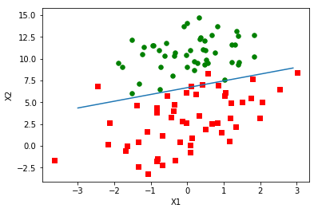

# 首个最优化算法：Logistic回归

### 1 概述

假设现在有一些数据点，我们用一条直线对这些点进行拟合（该线称为最佳拟合直线），这个拟合过程就称作回归。

利用Logistic回归进行分类的主要思想是：根据现有数据对分类边界线建立回归公式，以此进行分类。

* 优点：计算代价不高，易于理解和实现
* 缺点：容易欠拟合，分类精度可能不高
* 适用数据类型：数值型和标称型数据

### 2 Logistic回归的一般过程

1. 收集数据：采用任意方法收集数据。
2. 准备数据：由于需要进行距离计算，因此要求数据类型为数值型。另外，结构化数据格式则最佳。
3. 分析数据：采用任意方法对数据进行分析。
4. 训练算法：大部分时间将用于训练，训练的目的是为了找到最佳的分类回归系数。
5. 测试算法：一旦训练步骤完成，分类将会很快。
6. 使用算法：首先，我们需要输入一些数据，并将其转换成对应的结构化数值；接着，基于训练好的回归系数就可以对这些数值进行简单的回归计算，判定它们属于哪个类别；在这之后，我们就可以在输出的类别上做一些其他分析工作。

### 3 基于Logistic回归和Sigmoid函数的分类

#### 3.1 Sigmoid函数

处理二类回归问题，需要一个函数在输入连续的情况下输出0或1，以前接触过的海维塞德阶跃函数，在跳跃点的瞬间跳跃有时较难处理，所以引入Sigmoid函数

<center>$\sigma(z)=\frac{1}{1+e^{-z}}$</center>

性质和阶跃函数类似。

为了实现Logistic回归分类器，我们可以在每个特征上都乘以一个回归系数，然后把所有的结果值相加，将这个总和代入Sigmoid函数中，进而得到一个范围在0~1之间的数值。任何大于0.5的数据被分入1类，小于0.5即被归入0类。所以，Logistic回归也可以被看成是一种概率估计。


```python
from numpy import *
import matplotlib.pyplot as plt

def sigmoid(z):
    return 1.0 / (1 + exp(-z))

x = linspace(-50, 50, 500)
plt.plot(x, sigmoid(x))
plt.show()
```


    <Figure size 640x480 with 1 Axes>


#### 3.2 确定最佳回归系数：梯度上升法

* 梯度上升法（通常也称梯度下降法，只是两者正负号不同）

```
每个回归系数初始化为1
重复R次：
    计算整个数据集的梯度
    使用alpha × gradient更新回归系数的向量
    返回回归系数
```


```python
def loadDataSet():
    dataMat = []; labelMat = []
    fr = open('../data/logisticRegressionTestSet.txt')
    for line in fr.readlines():
        lineArr = line.strip().split()
        dataMat.append([1.0, float(lineArr[0]), float(lineArr[1])])
        labelMat.append(int(lineArr[2]))
    return dataMat,labelMat

def gradAscent(dataMatIn, classLabels):    
    dataMatrix = mat(dataMatIn)             #convert to NumPy matrix
    labelMat = mat(classLabels).transpose() #convert to NumPy matrix
    m,n = shape(dataMatrix)
    alpha = 0.001
    maxCycles = 500
    weights = ones((n,1))
    for k in range(maxCycles):              #heavy on matrix operations
        h = sigmoid(dataMatrix*weights)     #matrix mult
        error = (labelMat - h)              #vector subtraction
        weights = weights + alpha * dataMatrix.transpose()* error #matrix mult
    return weights
```


```python
dataArr, labelMat = loadDataSet()
weights = gradAscent(dataArr, labelMat)
weights
```


    matrix([[ 4.12414349],
            [ 0.48007329],
            [-0.6168482 ]])


```python
def plotBestFit(weights):
    import matplotlib.pyplot as plt
    dataMat,labelMat=loadDataSet()
    dataArr = array(dataMat)
    n = shape(dataArr)[0] 
    xcord1 = []; ycord1 = []
    xcord2 = []; ycord2 = []
    for i in range(n):
        if int(labelMat[i])== 1:
            xcord1.append(dataArr[i,1]); ycord1.append(dataArr[i,2])
        else:
            xcord2.append(dataArr[i,1]); ycord2.append(dataArr[i,2])
    fig = plt.figure()
    ax = fig.add_subplot(111)
    ax.scatter(xcord1, ycord1, s=30, c='red', marker='s')
    ax.scatter(xcord2, ycord2, s=30, c='green')
    x = arange(-3.0, 3.0, 0.1)
    y = (-weights[0]-weights[1]*x)/weights[2]
    ax.plot(x, y)
    plt.xlabel('X1'); plt.ylabel('X2');
    plt.show()
```


```python
plotBestFit(weights.getA())
```




